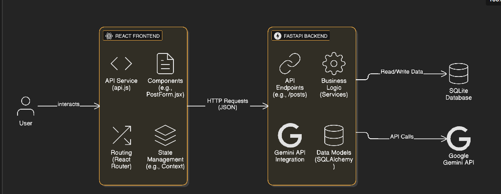

# AI Social Media Assistant

This project is a full-stack application designed to streamline your social media workflow. It uses AI to generate content based on your prompts and can post it directly to your social media accounts.

The application features a React-based frontend and a Python FastAPI backend.



## Features

- **AI-Powered Content Generation**: Provide a prompt, a platform (e.g., Twitter), and a tone (e.g., Professional, Casual) to generate unique social media posts.
- **Content History**: View and manage all the posts you've generated.
- **Direct Publishing**: Post your generated content directly to Twitter with a single click.
- **Extensible**: Easily add support for other social media platforms.

---

## Technologies Used

### Backend

- **[FastAPI](https://fastapi.tiangolo.com/)**: A modern, high-performance web framework for building APIs.
- **[SQLAlchemy](https://www.sqlalchemy.org/)**: The Python SQL Toolkit and Object Relational Mapper.
- **[Alembic](https://alembic.sqlalchemy.org/en/latest/)**: A lightweight database migration tool for SQLAlchemy.
- **[Groq](https://wow.groq.com/)**: Provides the fast AI inference for content generation.
- **[Tweepy](https://www.tweepy.org/)**: A Python library for accessing the Twitter API.
- **[Uvicorn](https://www.uvicorn.org/)**: An ASGI server for running the FastAPI application.

### Frontend

- **[React](https://reactjs.org/)**: A JavaScript library for building user interfaces.
- **[Vite](https://vitejs.dev/)**: A modern frontend build tool that provides a faster and leaner development experience.
- **[Axios](https://axios-http.com/)**: A promise-based HTTP client for the browser and Node.js.
- **[React Router](https://reactrouter.com/)**: For declarative routing in the React application.

---

## Setup and Installation

You will need to set up the backend and the frontend in separate terminal sessions.

### 1. Backend Setup

First, navigate to the `backend` directory:
```bash
cd backend
```

Create a virtual environment and activate it:
```bash
# For Windows
python -m venv venv
.\venv\Scripts\activate

# For macOS/Linux
python3 -m venv venv
source venv/bin/activate
```

Install the required Python packages:
```bash
pip install -r requirements.txt
```

#### Environment Variables

The backend requires API keys for the AI service (Groq) and Twitter. Create a `.env` file in the `backend` directory:

```
# backend/.env

# Get this from https://console.groq.com/keys
GROQ_API_KEY="YOUR_GROQ_API_KEY"

# Get these from your Twitter/X Developer account
TWITTER_API_KEY="YOUR_TWITTER_API_KEY"
TWITTER_API_SECRET_KEY="YOUR_TWITTER_API_SECRET_KEY"
TWITTER_ACCESS_TOKEN="YOUR_TWITTER_ACCESS_TOKEN"
TWITTER_ACCESS_TOKEN_SECRET="YOUR_TWITTER_ACCESS_TOKEN_SECRET"
```

#### Database Migrations

Once the environment is set up, run the database migrations to create the necessary tables:
```bash
alembic upgrade head
```

### 2. Frontend Setup

In a separate terminal, navigate to the `Frontend` directory:
```bash
cd Frontend
```

Install the required Node.js packages:
```bash
npm install
```

---

## Running the Application

### 1. Start the Backend Server

In your backend terminal (with the virtual environment activated):
```bash
uvicorn app.main:app --reload --port 8000
```
The API will be available at `http://localhost:8000`.

### 2. Start the Frontend Development Server

In your frontend terminal:
```bash
npm run dev
```
The application will be running at `http://localhost:5173`. Open this URL in your web browser to use the AI Social Media Assistant.

---

## API Endpoints

The backend exposes the following RESTful API endpoints:

- `GET /`: Welcome message for the API.
- `GET /health`: Health check for the service.
- `POST /api/v1/posts/generate`: Generates new social media content.
  - **Body**: `{ "prompt": "string", "platform": "string", "tone": "string" }`
- `GET /api/v1/posts/`: Retrieves a list of all previously generated posts.
- `POST /api/v1/posts/{post_id}/publish`: Publishes a specific post to Twitter.
